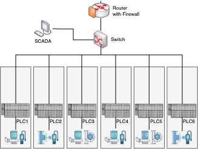

# Test Data

The test traffic capture used in this project is sourced from the Secure Water Treatment (SWaT) testbed [1] trace **SWaT.A6_Dec 2019** (`Dec2019_00000_20191206100500.pcap`).
We consider a simplified SWaT topology as illustrated: 

  

### Pre-processing

The traffic capure was pre-processed as follows:
- Filter traffic related to PLC1-6 and SCADA. 
- Extract the first 50,000 packets (due to file size limitations) and save them to `demo.pcap` (used in Docker network).

### Flow Analysis
The result of the flow analysis is saved to `demo.csv`.

### PoC - Unauthorized Access Attack
The unauthorized traffic used for the evaluation in the PoC (PLC6 -> PLC5; derived from communication between PLC1 and PLC6, IP-addresses adjusted) is saved to `unauthorized.pcap`.

[1]: A. P. Mathur and N. O. Tippenhauer, "SWaT: a water treatment testbed for research and training on ICS security," 2016 International Workshop on Cyber-physical Systems for Smart Water Networks (CySWater), Vienna, Austria, 2016, pp. 31-36, doi: 10.1109/CySWater.2016.7469060.