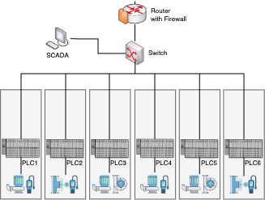

## Test Data

The test traffic captures used in this project are sourced from the Secure Water Treatment (SWaT) testbed [1] trace **SWaT.A6_Dec 2019** (`Dec2019_00000_20191206100500.pcap`).
We consider a simplified topology as illustrated: 

  

### Pre-processing

The pre-processing steps are executed using the `preprocess.sh` script. The key steps are as follows:

- Filter traffic related to PLC1-6 and SCADA. 
- Extract the first 50,000 packets (due to file size limitations) and save them to `dump.pcap` (used in Docker network).

### Flow Analysis
The result of the flow analysis is saved to `filtered_flows.csv`.

[1]: A. P. Mathur and N. O. Tippenhauer, "SWaT: a water treatment testbed for research and training on ICS security," 2016 International Workshop on Cyber-physical Systems for Smart Water Networks (CySWater), Vienna, Austria, 2016, pp. 31-36, doi: 10.1109/CySWater.2016.7469060.